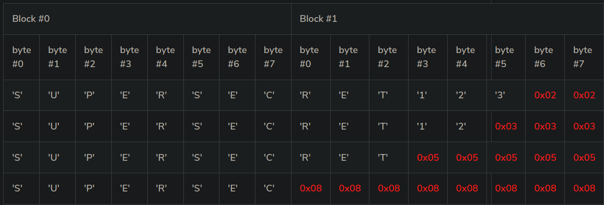

# Introduction

This course details the exploitation of a weakness in the authentication of a PHP website. The website uses Cipher Block Chaining (CBC) to encrypt information provided by users and use this information to ensure authentication. The application also leaks if the padding is valid when decrypting the information. We will see how this behavior can impact the authentication and how it can be exploited.

# Cipher Block Chaining

CBC is an encryption mode in which the message is split into blocks of X bytes length and each block is XORed with the previous encrypted block. The result is then encrypted.

The following schema (source: [Wikipedia](http://en.wikipedia.org/wiki/Block_cipher_mode_of_operation)) explains this method:


During the decryption, the reverse operation is used. The encrypted data is split in block of X bytes. Then the block is decrypted and XORed with the previous encrypted block to get the cleartext. The following schema (source: [Wikipedia](http://en.wikipedia.org/wiki/Block_cipher_mode_of_operation)) highlights this behavior:


Since the first block does not have a previous block, an initialization vector (IV) is used.

# Padding

As we saw, the encryption is done by blocks of fixed size. To ensure that the cleartext exactly fit in one or multiple blocks, padding is often used. Padding can be done in multiple ways. A common way is to use PKCS7. With PKCS7, the padding will be composed of the same number: the number of bytes missing. For example, if the cleartext is missing 2 bytes, the padding will be `\x02\x02`.

Let's look at more examples with a 2 blocks:



# Padding Oracle

When an application decrypts encrypted data, it will first decrypt the data; then it will remove the padding. During the cleanup of the padding, if an invalid padding triggers a detectable behavior, you have a padding oracle. The detectable behavior can be an error, a lack of results, or a slower response.

If you can detect this behavior, you can decrypt the encrypted data and even re-encrypt the cleartext of your choice.

## The theory

If we zoom in, we can see that the cleartext byte `C15` is just a XOR between the encrypted byte `E7` from the previous block, and byte `I15` which came out of the block decryption step:


This is also valid for all other bytes:

-   `C14 = I14 ^ E6`
-   `C13 = I13 ^ E5`
-   `C12 = I12 ^ E4`
-   ...

Now if we modify `E7` and keep changing its value, we will keep getting an invalid padding. Since we need `C15` to be `\x01`. However, there is one value of `E7` that will give us a valid padding. Let's call it `E'7`. With `E'7`, we get a valid padding. And since we know we get a valid padding we know that `C'15` (as in `C15` for `E'7`) is `\x01`.

`\x01 = I15 ^ E'7`

The gives us:

`I15 = \x01 ^ E'7`

So we are able to compute `I15`.

Since we know `I15`, we can now compute `C15`

`C15 = E7 ^ I15 = E7 ^ \x01 ^ E'7`

Now that we have `C15`, we can move to brute-forcing `C14`. First we need to compute another `E7` (let's call it `E''7`) that gives us `C15 = \x02`. We need to do that since we want the padding to be `\x02\x02` now. It's really simple to compute using the property above and by replacing the value of `C15` we want (`\x02`) and `I15` we now know:

`E''7 = \x02 ^ I15`

After brute force `E6`, to find the value that gives us a valid padding `E''6`, we can re-use the formula:

`C14 = I14 ^ E6`

to get

`I14 = \x02 ^ E''6`

Once we get `I14`, we can compute `C14`:

`C14 = E6 ^ I14 = E6 ^ \x02 ^ E''6`

Using this method, we can keep going until we get all the ciphertext decrypted.

## Detection of the vulnerability

To get started, you can register an account and log in with this account (to make things easier, you get automatically logged in when you register).

If you create an account and log in two times with this account, you can see that the cookie sent by the application didn't change.

**If you log in many times and always get the same cookie, there is probably something wrong in the application. The cookie sent back should be unique each time you log in. If the cookie is always the same, it will probably always be valid and there won't be anyway to invalidate it.**

Now, if you try to modify the cookie, you can see that you get an error from the application.

## Exploitation using PadBuster

By using [PadBuster](https://github.com/GDSSecurity/PadBuster), you can exploit this issue in a matter of seconds. To do so, you will need to follow the following steps using PadBuster:

-   Decrypt the cookie.
-   Generate a new cookie to become `admin`.

## Manual exploitation

To ensure you get a good understanding of this attack, it's strongly recommended that you write your own tool.

To do, it's recommended to work locally. For example, the following code can be used to create a padding oracle in Ruby:
```rb
def right_padding?(data)
  cipher = OpenSSL::Cipher::Cipher.new('des-cbc')
  cipher.decrypt
  cipher.key = “testtest"
  cipher.iv = "12345678"
  begin
    cipher.update(data)+cipher.final
    return true
  rescue Exception => e
    return false
  end
end
```
# Conclusion

This exercise showed you how you can tamper encrypted information without decrypting them and use this behavior to gain access to other accounts. It showed you that encryption can not be used as a replacement to signature and how it's possible to use a padding oracle to decrypt and re-encrypt information.